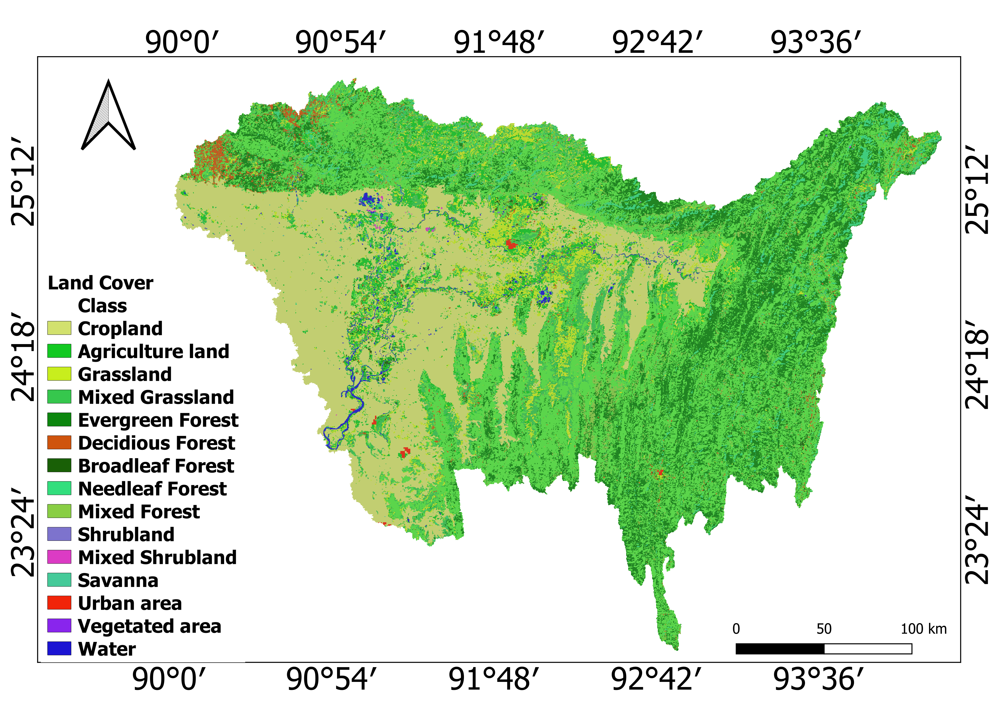
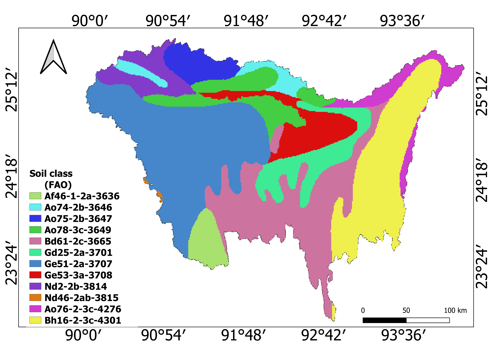

[Home page](./README.md)&nbsp;&nbsp;&nbsp;[Education](./education.md)&nbsp;&nbsp;&nbsp;[Work](./Work.md)&nbsp;&nbsp;&nbsp;[My Blog](./My_Blog.md)&nbsp;&nbsp;&nbsp;[Research](./research.md)

#### Current Project

Assessing the geo-engineering impacts on hydrology (Ganges, Brahmaputra, Meghna basin) in Bangladesh," Funded by: UNESCO-TWAS, Degree initiative (P.I.- Dr. Abu Syed, C4RE Foundation).  

**Supervisor:** [Dr. Shyamal Karmakar](https://www.researchgate.net/profile/Shyamal-Karmakar)  

In this project we are trying to see how three major rivers of delta region response to GeoMIP projected climate data to assess its impact using SWAT tool. We used QGIS interface for developing model. To assess the model performance (R2, NSE, PBIAS) SWAT-CUP has been used.  

  
   
  
#### Completed Project 
Poster Paper:  

    
[Hydrological Modelling of Halda River For Storm Runoff and Base Flow Prediction Towards Sustainable Water Management.](https://dx.doi.org/10.13140/RG.2.2.22918.45122) 1st Jamal Nazrul Islam National Conference - 2022 (JNINC 2022) for Young Researchers, 21 May 2022. University of Chittagong.  

[Credential](./images/1st_jamal_nazrul_Islam.pdf)
  
**Manuscripts under review:**  

Discharge and sediment load modeling using rating curve-based missing data management for the Halda River Catchment of Bangladesh.  

Rainfall-Runoff modeling using HEC-HMS flow modeling framework for Halda River Catchment, Bangladesh.  

 
 

  
  
  
  

